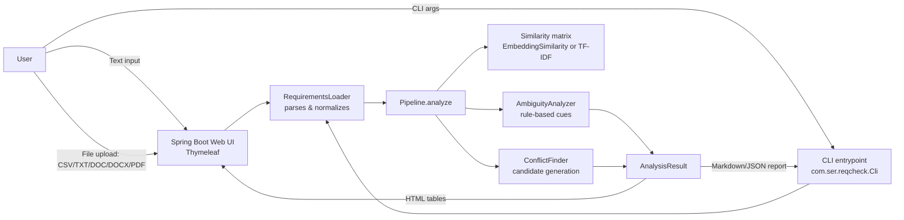
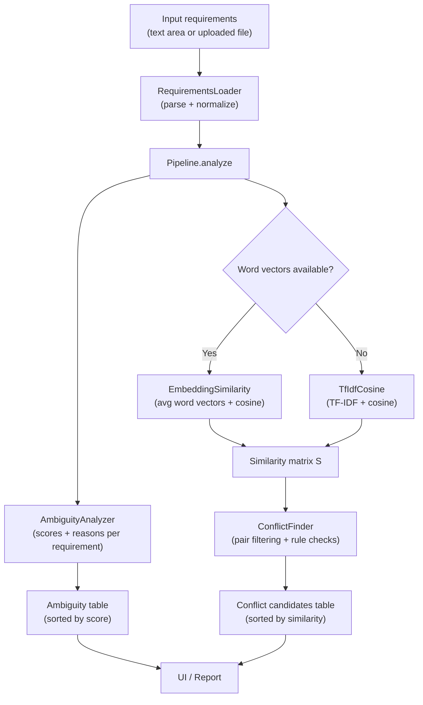
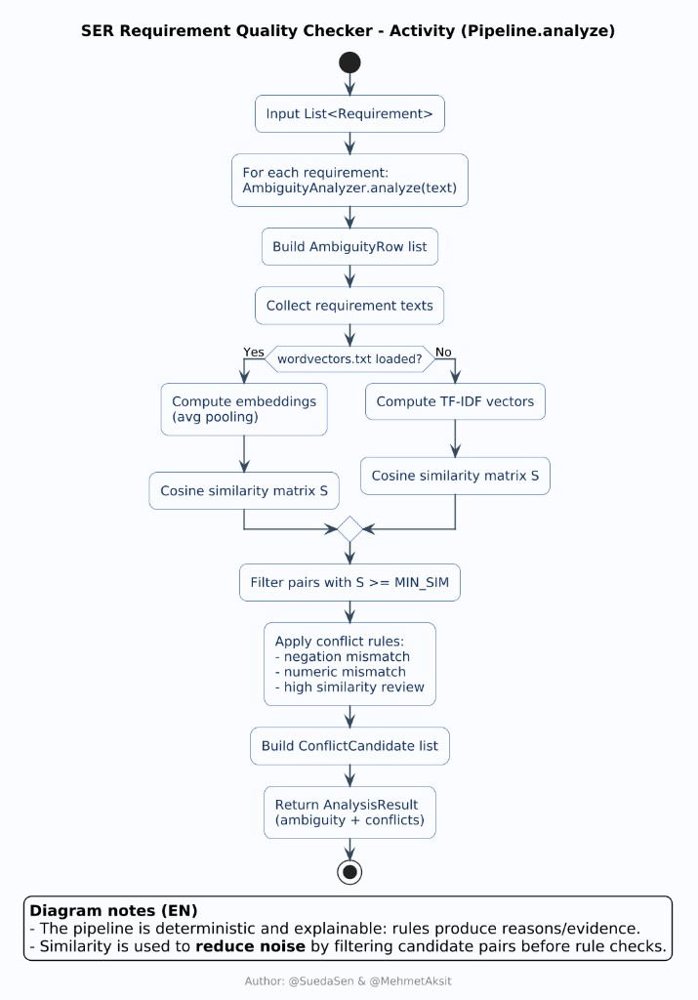
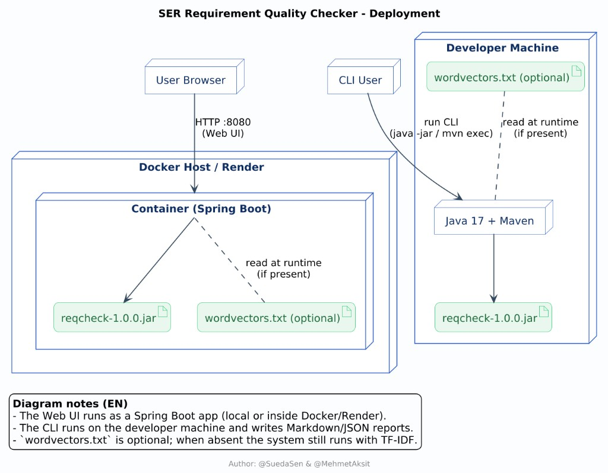
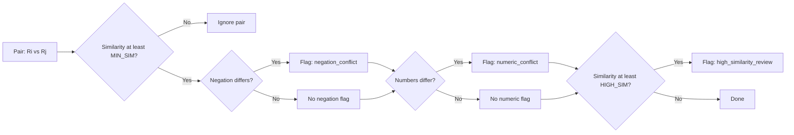

# SER Requirement Quality Checker (Java)

This project analyzes natural-language software requirements and highlights:
- **Ambiguity findings** (possibly unclear statements)
- **Inconsistency candidates** (possibly conflicting requirement pairs)

It includes both a **Web UI** and a **CLI** workflow.

It is designed as a lightweight “first pass” quality gate: it does not replace human review, but helps teams focus attention on higher-risk requirements early.

## Why This Project Exists

Requirements are often written in natural language, which can introduce:
- vague wording,
- hidden contradictions,
- and inconsistent numeric constraints (e.g., different time limits).

This tool provides a first-pass quality check so teams can review risky requirements earlier.

## What You Can Present (Technical Overview)

- **Goal**: ingest requirements (typed or uploaded) → run an analysis pipeline → show ranked ambiguity findings and conflict candidates.
- **Key idea**: combine **rule-based NLP heuristics** (ambiguity cues, negation/numbers) with **similarity-based pairing** (word-embedding similarity when available, otherwise TF‑IDF cosine).
- **Outputs**:
  - **Ambiguity table**: per requirement, a score \([0..1]\) + human-readable reasons.
  - **Conflict candidates**: requirement pairs worth review (negation mismatch, numeric mismatch, or very high similarity).

## How “Machine Learning” Is Used in This Project (Scope)

This project matches the topic **“Using Machine Learning to Detect Ambiguity and Inconsistency in Software Requirements”** by using ML primarily for **semantic similarity**:

- **ML piece (semantic similarity)**:
  - When `src/main/resources/wordvectors.txt` is available, the system computes **sentence embeddings** by averaging pre-trained **word vectors** (average pooling), then uses **cosine similarity** to build an \(N \times N\) similarity matrix.
  - This matrix is used to **prioritize which requirement pairs** are worth checking for conflicts (it is a candidate generator / filter).
- **Rule-based piece (interpretable flags)**:
  - Ambiguity is detected via interpretable heuristics (weak modal verbs, vague adjectives, open-ended timing phrases, etc.) and returns human-readable reasons.
  - Conflicts are flagged with simple, explainable rules (negation mismatch, numeric/time/percent mismatch, and “high similarity review”).
- **Fallback strategy**:
  - If embeddings are unavailable, the system falls back to **TF‑IDF cosine** similarity so the pipeline still works end-to-end.

In short: **ML helps the tool understand “meaning similarity”**, and **rules produce explainable quality signals**.

## Core Capabilities

- Analyze plain text requirements (one per line)
- Upload requirement documents: `CSV`, `TXT`, `DOC`, `DOCX`, `PDF`
- Show ambiguity and inconsistency tables
- Export analysis results as CSV in the Web UI
- Use multilingual interface support (Turkish / English)

## High-Level Architecture



## Analysis Pipeline (How Results Are Produced)

```mermaid
sequenceDiagram
  participant Input as Requirements (List)
  participant A as AmbiguityAnalyzer
  participant E as EmbeddingSimilarity
  participant T as TfIdfCosine
  participant C as ConflictFinder
  participant Out as AnalysisResult

  Input->>A: analyze(text) for each requirement
  Input->>E: similarityMatrix(texts, wordvectors?)
  alt Word vectors available
    E-->>C: similarity matrix (cosine over avg word vectors)
  else Fallback
    Input->>T: similarityMatrix(texts) (TF-IDF cosine)
    T-->>C: similarity matrix
  end
  C-->>Out: conflict candidates (filtered by similarity thresholds)
  A-->>Out: ambiguity rows (score + reasons)
```



## Data Flow (From Input to Tables)



## UML Diagrams (PlantUML Renders)

The following diagrams were generated from **PlantUML** and rendered as images for presentation/documentation.
They complement the Mermaid diagrams above by providing a more “UML-standard” view of the system.

### Use Case Diagram

**Definition (what this diagram is):**  
A Use Case diagram describes the system from the user’s point of view: **who interacts** with it (actors) and **what goals** they achieve (use cases). It is best for explaining *scope* and *capabilities* without talking about internal code structure.

**What this diagram explains in this project:**  
- A **Requirements Engineer** can provide requirements either by typing them or uploading a file.
- The system runs analysis and provides two key outcomes:
  - **Ambiguity findings** (single‑requirement quality issues)
  - **Inconsistency candidates** (pairs of requirements worth review)
- Similarity is computed in two possible ways: **ML embeddings** (when `wordvectors.txt` is available) or **TF‑IDF cosine** fallback.
- Results can be consumed through:
  - Web UI tables (plus CSV export)
  - CLI reports (Markdown/JSON)

**How to read it (quick guide):**  
- **Actor → Use case** arrows show who initiates an action.
- `<<include>>` means a use case is always part of another (mandatory sub‑step).
- `<<extend>>` highlights an optional/conditional behavior (e.g., ML vs fallback similarity).

**Key terms (mini glossary):**  
- **Actor**: an external role (human/user) interacting with the system.  
- **Use case**: a user goal/capability (e.g., “Analyze requirements”).  
- **Ambiguity finding**: a potentially unclear requirement; output includes a score + reasons.  
- **Inconsistency candidate**: a pair of requirements that might conflict; output includes similarity + evidence.  
- **TF‑IDF cosine**: keyword‑based similarity method used when embeddings are unavailable.  
- **Word embeddings**: vector representations of words used to estimate semantic similarity.


### Component Diagram

**Definition (what this diagram is):**  
A Component diagram describes the system as **high-level modules** and the **dependencies/communication** between them. It is best for explaining architecture and separation of concerns.

**What this diagram explains in this project:**  
- There are two “front doors” into the system:
  - **Web UI** (Spring MVC + Thymeleaf via `WebController`)
  - **CLI** (via `Cli`)
- Both entry points reuse the same core pipeline:
  - `RequirementsLoader` → `Pipeline` → analyzers/similarity → conflict detection
- ML similarity is **optional** and depends on loading `wordvectors.txt`. If missing, the system still functions via TF‑IDF.

**How to read it (quick guide):**  
- Boxes represent components/modules.  
- Arrows represent “uses/calls” relationships (data/requests flow along the arrows).  
- The database‑shaped node (`wordvectors.txt`) indicates an external resource dependency.

**Key terms (mini glossary):**  
- **Web UI**: browser-facing interface that renders results as HTML tables.  
- **CLI**: command-line interface that writes results as Markdown/JSON.  
- **Pipeline**: orchestration layer that runs the full analysis end-to-end.  
- **Similarity matrix**: \(N \times N\) pairwise similarity scores for requirements.  
- **Optional dependency**: a resource that improves results when present but is not required to run.


### Class Diagram

**Definition (what this diagram is):**  
A Class diagram describes **static structure** at code level: classes/records, their responsibilities, and dependencies. It is best for answering “which classes exist and how are they connected?”

**What this diagram explains in this project (map of responsibilities):**  
- **Entry points**:
  - `WebController`: accepts user input, triggers analysis, and prepares data for the UI.
  - `Cli`: loads input from disk, runs analysis, and writes reports.
- **Input parsing**:
  - `RequirementsLoader`: converts CSV/TXT/DOC/DOCX/PDF into `List<Requirement>`.
- **Core analysis**:
  - `Pipeline`: orchestrates ambiguity analysis + similarity + conflict detection.
  - `AmbiguityAnalyzer`: produces `AmbiguityFinding` (score + reasons).
  - `EmbeddingSimilarity` + `WordVectorStore`: embedding-based similarity when vectors are available.
  - `TfIdfCosine`: fallback similarity (works with no vectors).
  - `ConflictFinder`: generates `ConflictCandidate` outputs with kind/evidence.
- **Output representation**:
  - `AnalysisResult`: container for ambiguity rows and conflicts.
  - `ViewResult` / `View*`: UI-friendly DTOs (getter-based) for Thymeleaf rendering.
  - `ReportWriter`: produces Markdown/JSON for the CLI.

**How to read it (quick guide):**  
- Boxes are types (classes/records).  
- Arrows (`..>`/`-->`) show “uses/depends on”.  
- Aggregation (`o--`) indicates “contains a collection of”.  

**Key terms (mini glossary):**  
- **Record**: a Java 16+ data carrier type (immutable fields, auto-generated accessors).  
- **DTO (View model)**: “presentation-only” type used to render in a template/UI.  
- **Evidence**: a human-readable string explaining why a conflict candidate was flagged.


### Domain / Conceptual Model

**Definition (what this diagram is):**  
A Domain/Conceptual model focuses on the **meaning of the data** the system produces (business concepts), rather than frameworks or controllers. It is best for explaining “what the outputs represent”.

**What this diagram explains in this project:**  
- A **Requirement** is the atomic unit of analysis (id + text).
- The pipeline returns exactly one **AnalysisResult** containing:
  - `AmbiguityRow` items (per requirement: score + reasons)
  - `ConflictCandidate` items (per pair: similarity + kind + evidence)
- A `ConflictCandidate` conceptually points to **two requirements** (left/right) and describes *why* they are worth manual review.
- A `SimilarityMatrix` represents the pairwise similarity space used for filtering/ranking.

**How to read it (quick guide):**  
- Multiplicities (e.g., `0..*`) show cardinality:
  - one `AnalysisResult` contains many ambiguity rows / conflict candidates.
- Labels “left (by id)” and “right (by id)” indicate the candidate references two requirements.

**Key terms (mini glossary):**  
- **Cardinality (0..*, 1, 2..*)**: how many instances can be linked.  
- **Similarity score**: a numeric measure \([0..1]\) used to decide whether to evaluate a pair.  
- **Kind**: the reason category for a candidate (`negation_conflict`, `numeric_conflict`, `high_similarity_review`).  
- **Reasons vs evidence**:
  - **Reasons**: explanation list for ambiguity (single requirement).
  - **Evidence**: explanation string for a conflict candidate (pair).


### Sequence Diagram (Web Analyze Flow)

**Definition (what this diagram is):**  
A Sequence diagram shows **time-ordered interactions** between actors/objects. It is best for explaining “what happens when I click Analyze?” at runtime.

**What this diagram explains in this project:**  
- **Input path selection**:
  - File upload → format detection → `RequirementsLoader.load(...)`
  - Text area → line split → `Requirement(R1..Rn)`
- **End-to-end analysis**:
  - `Pipeline.analyze(...)` triggers ambiguity analysis (loop per requirement).
  - Similarity matrix is computed (ML if possible, TF‑IDF fallback otherwise).
  - `ConflictFinder` generates conflict candidates using similarity thresholds + rule checks.
- **UI preparation**:
  - Output is wrapped into view DTOs (`ViewResult`) and rendered back as HTML.

**How to read it (quick guide):**  
- Vertical dashed lines are **lifelines** (an object over time).  
- Horizontal arrows are **calls/messages**.  
- `alt` blocks represent **branching** (file vs text; ML vs fallback).  
- `loop` blocks represent **repeated steps** (per requirement).

**Key terms (mini glossary):**  
- **Lifeline**: timeline of an object in the scenario.  
- **alt / loop**: UML constructs for branching / iteration.  
- **DTO**: view-specific data objects used for template rendering.  
- **POST /analyze**: the web endpoint that triggers the pipeline.


### Activity Diagram (Pipeline.analyze)

**Definition (what this diagram is):**  
An Activity diagram shows a **workflow**: the step-by-step control flow of a process, including decisions. It is best for explaining the algorithmic pipeline at a “flowchart” level.

**What this diagram explains in this project:**  
- The pipeline begins with a list of requirements and produces one `AnalysisResult`.
- Ambiguity analysis is done **per requirement** (scores + reasons).
- Similarity is computed in one of two branches:
  - Embedding similarity (ML) if vectors are loaded
  - TF‑IDF cosine otherwise
- Only pairs above a minimum similarity threshold are checked for conflict rules.

**How to read it (quick guide):**  
- Rounded rectangles are steps/actions.  
- Diamonds represent decisions (Yes/No).  
- The flow ends when the result object is returned.

**Key terms (mini glossary):**  
- **Threshold filtering**: ignoring pairs with low similarity to reduce noise and computation.  
- **Deterministic**: same input produces same output (no stochastic model inference here).  
- **Explainable rules**: heuristics that produce human-readable reasons/evidence.



### Deployment Diagram

**Definition (what this diagram is):**  
A Deployment diagram shows the system mapped to **runtime environments** (machines/containers) and the **artifacts** deployed there (e.g., jar files). It is best for explaining “where does it run and what does it need?”

**What this diagram explains in this project:**  
- The Web UI can run:
  - locally (developer machine), or
  - inside Docker (e.g., on Render)
- The CLI runs locally and produces report files.
- The same jar artifact (`reqcheck-1.0.0.jar`) is the runnable unit in both cases.
- The optional ML resource (`wordvectors.txt`) is read at runtime when present.

**How to read it (quick guide):**  
- Large 3D boxes are nodes/environments (machine/container).  
- Small “document” icons represent deployed artifacts (jar/resources).  
- Arrows show runtime communication paths (e.g., browser → HTTP → container).

**Key terms (mini glossary):**  
- **Artifact**: a deployable build output (here: the runnable jar).  
- **Node**: a runtime environment (machine, container, hosted service).  
- **Runtime dependency**: a resource used while the app runs (e.g., vectors file).  
- **Port 8080**: default HTTP port for the Spring Boot Web UI.



## How Conflict Candidates Are Generated (Decision View)

Candidate generation happens in two phases:

1) **Pair filtering**: only requirement pairs with similarity \(S[i][j] \ge MIN\_SIM\) are evaluated for conflicts.  
2) **Explainable rules**: each surviving pair may get 0..N flags (negation, numeric mismatch, high similarity review).



## Project Structure

```text
.
├── pom.xml
├── Dockerfile
├── README.md
├── data/
│   └── sample_requirements.csv
└── src/
    └── main/
        ├── java/
        │   └── com/ser/reqcheck/
        │       ├── ReqcheckApplication.java      # Spring Boot entrypoint
        │       ├── WebController.java            # Web UI: upload/text → analyze → render
        │       ├── Cli.java                      # CLI entrypoint: file → analyze → report
        │       ├── RequirementsLoader.java       # CSV/TXT/DOC/DOCX/PDF → List<Requirement>
        │       ├── Pipeline.java                 # orchestrates ambiguity + similarity + conflicts
        │       ├── AmbiguityAnalyzer.java        # rule-based ambiguity scoring + reasons
        │       ├── ConflictFinder.java           # rule-based conflict candidate generation
        │       ├── EmbeddingSimilarity.java      # ML similarity: avg word vectors + cosine
        │       ├── TfIdfCosine.java              # fallback similarity: TF-IDF + cosine
        │       ├── WordVectorStore.java          # loads/serves word vectors
        │       ├── ReportWriter.java             # Markdown/JSON output for CLI
        │       └── (view models + DTOs)
        └── resources/
            ├── templates/index.html              # Thymeleaf UI
            ├── messages.properties               # i18n (EN)
            ├── messages_tr.properties            # i18n (TR)
            └── wordvectors.txt                   # optional: enables embedding similarity
```

## Key Components (Code Map)

- **`WebController`**: Spring MVC controller that accepts textarea input or a file upload and renders results in `templates/index.html`.
- **`Cli`**: command-line entrypoint that loads a file, runs the pipeline, and writes a **Markdown** or **JSON** report.
- **`RequirementsLoader`**: parses inputs into `List<Requirement>`:
  - **CSV**: requires a `text` column (optional `id` column).
  - **TXT**: one requirement per non-empty line.
  - **DOC/DOCX**: one requirement per paragraph.
  - **PDF**: extracted text split into non-empty lines.
- **`Pipeline`**: orchestration layer:
  - ambiguity analysis → similarity matrix → conflict candidate generation.
  - uses embedding similarity if `src/main/resources/wordvectors.txt` loads; otherwise TF‑IDF fallback.
- **`AmbiguityAnalyzer`**: rule-based heuristics (weak modal verbs, vague adjectives, open-ended temporal phrases, passive voice hints, pronoun ambiguity).
- **`EmbeddingSimilarity`**: sentence embedding via **average pooling** of word vectors + cosine similarity.
- **`TfIdfCosine`**: TF‑IDF vectorization + cosine similarity fallback.
- **`ConflictFinder`**: candidate generation rules applied only to pairs above a minimum similarity:
  - **negation conflict**: one requirement has negation cues and the other does not
  - **numeric conflict**: mismatched numbers/time units/percentages
  - **high similarity review**: very similar pairs flagged for redundancy/contradiction review

## Similarity Thresholds (Current Defaults)

Defined in `Pipeline`:

- **`MIN_SIM = 0.45`**: pairs below this are ignored (reduces noise).
- **`HIGH_SIM = 0.65`**: pairs above this also get a “high similarity review” flag.

## Terminology (Quick Reference Table)

| Term | Meaning in this project | Where it appears |
|---|---|---|
| Requirement | A single natural-language statement describing what a system must/should do | input lines, `Requirement` |
| Ambiguity | A single requirement that is potentially unclear / open to multiple interpretations | `AmbiguityAnalyzer`, ambiguity table |
| Inconsistency (candidate) | A *pair* of requirements that might contradict or strongly disagree | `ConflictFinder`, conflict candidates table |
| Heuristic (rule-based) | Hand-crafted patterns (e.g., “should”, “fast”, negation cues) used to produce explainable flags | `AmbiguityAnalyzer`, `ConflictFinder` |
| Word embedding | Pre-trained vector representation of words used to approximate semantic meaning | `wordvectors.txt`, `WordVectorStore` |
| Sentence embedding (avg pooling) | Sentence vector computed by averaging distinct non-stopword word vectors | `EmbeddingSimilarity` |
| Cosine similarity | Measures vector-direction similarity; used to rank/filter pairs | `EmbeddingSimilarity`, `TfIdfCosine` |
| Similarity matrix \(S\) | Pairwise similarity for all requirements (size \(N \times N\)) | `Pipeline`, `ConflictFinder` |
| Threshold filtering | Only pairs with \(S \ge MIN\_SIM\) are examined for conflicts | `Pipeline` |
| TF‑IDF | Keyword-based vectorization used as similarity fallback | `TfIdfCosine` |
| Evidence | Human-readable reason attached to a flag (e.g., “Different numbers…”) | `ConflictCandidate.evidence` |

## What the Output Tables Look Like (Examples)

Ambiguity table (sorted by descending score):

| ID | Score | Text | Reasons |
|---|---:|---|---|
| R3 | 0.60 | The system should provide fast performance. | Optionality/weak modal verbs; Vague quality adjectives |

Conflict candidates (sorted by descending similarity):

| Left | Right | Similarity | Kind | Evidence |
|---|---|---:|---|---|
| R1 | R2 | 0.78 | numeric_conflict | Different numbers: [2s] vs [5s] |
| R4 | R5 | 0.72 | negation_conflict | One contains negation, the other does not. |
| R4 | R5 | 0.72 | high_similarity_review | High textual similarity; review for redundancy/contradiction. |

## Tech Stack

- **Java 17**
- **Spring Boot** (Web + MVC)
- **Thymeleaf** (UI templating)
- **OpenCSV** (CSV parsing)
- **Apache POI** (DOC/DOCX parsing)
- **Apache PDFBox** (PDF parsing)
- **Maven** (build/dependency management)

## Prerequisites

- **JDK 17+**
- **Maven 3.6+**

## Build

```bash
mvn -q package
```

## Run Web UI

```bash
mvn spring-boot:run
```

Open: `http://localhost:8080`

## Run CLI

Generate a Markdown report:

```bash
mvn -q exec:java -Dexec.mainClass="com.ser.reqcheck.Cli" \
  -Dexec.args="--input data/sample_requirements.csv --format csv --out reports/report.md"
```

Generate a Markdown report **with F1 evaluation** (requires a gold CSV with `text,ambiguous` columns):

```bash
mvn -q exec:java -Dexec.mainClass="com.ser.reqcheck.Cli" \
  -Dexec.args="--input data/sample_requirements.csv --format csv --out reports/report.md --gold data/gold_ambiguity.csv --threshold 0.50"
```

Generate **both English and Turkish** Markdown reports:

```bash
mvn -q exec:java -Dexec.mainClass="com.ser.reqcheck.Cli" \
  -Dexec.args="--input data/sample_requirements.csv --format csv --out reports/report.md --out-lang both --gold data/gold_ambiguity.csv --threshold 0.50"
```

This writes:
- `reports/report.md` (English)
- `reports/report_tr.md` (Turkish)

## Datasets & Evaluation Guide (EN/TR)

- English: `docs/datasets_and_evaluation_en.md`
- Türkçe: `docs/datasets_and_evaluation_tr.md`

Generate a JSON report:

```bash
mvn -q exec:java -Dexec.mainClass="com.ser.reqcheck.Cli" \
  -Dexec.args="--input data/sample_requirements.csv --format csv --out reports/report.json --out-format json"
```

Create output directory first if needed:

```bash
mkdir -p reports
```

## Input Formats (CLI)

- **CSV**: `--format csv` and a `text` column is required (optional `id` column).
- **TXT**: `--format txt` and each non-empty line is treated as a requirement.

## Run as JAR

```bash
mvn -q package
java -jar target/reqcheck-1.0.0.jar
```

## Run with Docker (local)

Build the image:

```bash
docker build -t ser-requirement-checker .
```

Run the container:

```bash
docker run --rm -p 8080:8080 ser-requirement-checker
```

Open: `http://localhost:8080`

## Deploy on Render (Docker)

This repository includes a `Dockerfile` and a `render.yaml` blueprint so Render can build and run the app **without** needing Maven installed on Render’s host (the build happens inside Docker).

1. In Render, create a **New Web Service**
2. Connect your public GitHub repository
3. Select **Environment/Runtime: Docker**
4. **Dockerfile Path**: `Dockerfile` (repo root)
5. Keep **Root Directory** as the repository root (default)
6. **Build Command**: leave **empty** (Docker build uses the Dockerfile)
7. **Start Command**: leave **empty** (the image `CMD` starts the JAR with `PORT` from Render)
8. Deploy

After deployment, open your `onrender.com` service URL.

Notes:
- Free instances may spin down on inactivity and can take ~30–60 seconds to wake up.
- First Docker build can take several minutes.

### Troubleshooting: deploy exits with status **127**

Exit **127** almost always means **“command not found”** during the build or start step.

- If **Runtime is Docker** but the dashboard still has a custom **Build Command** (for example `mvn package` or `npm install`), Render may try to run that **on the host** where `mvn` / `node` is not installed → **127**. Clear the Build Command and rely on the Dockerfile.
- If you use a **native Java** runtime instead of Docker, you must use the **Maven Wrapper**: `./mvnw clean package` (this repo includes `mvnw`), not plain `mvn`, unless you add a buildpack that provides Maven.
- After pushing changes, trigger **Manual Deploy** so Render picks up the updated `Dockerfile` / `render.yaml`.

## Course Context

This project was prepared for the **SER515** course as a practical requirement quality analysis tool combining rule-based and ML-supported techniques.
It was developed collaboratively by **Sueda Sen** and **Mehmet Aksit**.
