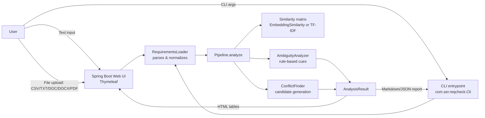
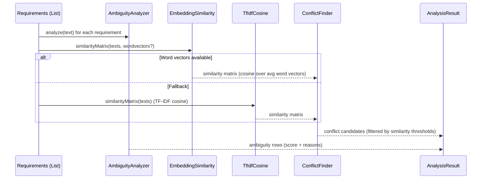

# SER Requirement Quality Checker (Java)

This project analyzes natural-language software requirements and highlights:
- **Ambiguity findings** (possibly unclear statements)
- **Inconsistency candidates** (possibly conflicting requirement pairs)

It includes both a **Web UI** and a **CLI** workflow.

It is designed as a lightweight “first pass” quality gate: it does not replace human review, but helps teams focus attention on higher-risk requirements early.

## Why This Project Exists

Requirements are often written in natural language, which can introduce:
- vague wording,
- hidden contradictions,
- and inconsistent numeric constraints (e.g., different time limits).

This tool provides a first-pass quality check so teams can review risky requirements earlier.

## What You Can Present (Technical Overview)

- **Goal**: ingest requirements (typed or uploaded) → run an analysis pipeline → show ranked ambiguity findings and conflict candidates.
- **Key idea**: combine **rule-based NLP heuristics** (ambiguity cues, negation/numbers) with **similarity-based pairing** (word-embedding similarity when available, otherwise TF‑IDF cosine).
- **Outputs**:
  - **Ambiguity table**: per requirement, a score \([0..1]\) + human-readable reasons.
  - **Conflict candidates**: requirement pairs worth review (negation mismatch, numeric mismatch, or very high similarity).

## How “Machine Learning” Is Used in This Project (Scope)

This project matches the topic **“Using Machine Learning to Detect Ambiguity and Inconsistency in Software Requirements”** by using ML primarily for **semantic similarity**:

- **ML piece (semantic similarity)**:
  - When `src/main/resources/wordvectors.txt` is available, the system computes **sentence embeddings** by averaging pre-trained **word vectors** (average pooling), then uses **cosine similarity** to build an \(N \times N\) similarity matrix.
  - This matrix is used to **prioritize which requirement pairs** are worth checking for conflicts (it is a candidate generator / filter).
- **Rule-based piece (interpretable flags)**:
  - Ambiguity is detected via interpretable heuristics (weak modal verbs, vague adjectives, open-ended timing phrases, etc.) and returns human-readable reasons.
  - Conflicts are flagged with simple, explainable rules (negation mismatch, numeric/time/percent mismatch, and “high similarity review”).
- **Fallback strategy**:
  - If embeddings are unavailable, the system falls back to **TF‑IDF cosine** similarity so the pipeline still works end-to-end.

In short: **ML helps the tool understand “meaning similarity”**, and **rules produce explainable quality signals**.

## Core Capabilities

- Analyze plain text requirements (one per line)
- Upload requirement documents: `CSV`, `TXT`, `DOC`, `DOCX`, `PDF`
- Show ambiguity and inconsistency tables
- Export analysis results as CSV in the Web UI
- Use multilingual interface support (Turkish / English)

## High-Level Architecture



## Analysis Pipeline (How Results Are Produced)



## Data Flow (From Input to Tables)

```mermaid
flowchart TD
  A[Input requirements<br/>Text area or uploaded file] --> B[RequirementsLoader<br/>normalize into List&lt;Requirement&gt;]
  B --> C[Pipeline.analyze]
  C --> D[AmbiguityAnalyzer<br/>scores + reasons per requirement]
  C --> E{Word vectors available?}
  E -->|Yes| F[EmbeddingSimilarity<br/>avg word vectors + cosine]
  E -->|No| G[TfIdfCosine<br/>TF-IDF + cosine]
  F --> H[Similarity matrix S]
  G --> H[Similarity matrix S]
  H --> I[ConflictFinder<br/>pair filtering + rule checks]
  D --> J[Ambiguity table<br/>(sorted by score)]
  I --> K[Conflict candidates table<br/>(sorted by similarity)]
  J --> L[UI/Report]
  K --> L[UI/Report]
```

## How Conflict Candidates Are Generated (Decision View)

Candidate generation happens in two phases:

1) **Pair filtering**: only requirement pairs with similarity \(S[i][j] \ge MIN\_SIM\) are evaluated for conflicts.  
2) **Explainable rules**: each surviving pair may get 0..N flags (negation, numeric mismatch, high similarity review).

```mermaid
flowchart LR
  P[Pair (Ri, Rj)] --> S{Similarity >= MIN_SIM?}
  S -->|No| X[Ignore pair]
  S -->|Yes| N{Negation differs?}
  N -->|Yes| N1[Flag: negation_conflict]
  N -->|No| N2[No negation flag]
  N1 --> M{Numbers differ?}
  N2 --> M{Numbers differ?}
  M -->|Yes| M1[Flag: numeric_conflict]
  M -->|No| M2[No numeric flag]
  M1 --> H{Similarity >= HIGH_SIM?}
  M2 --> H{Similarity >= HIGH_SIM?}
  H -->|Yes| H1[Flag: high_similarity_review]
  H -->|No| H2[Done]
```

## Project Structure

```text
.
├── pom.xml
├── Dockerfile
├── README.md
├── data/
│   └── sample_requirements.csv
└── src/
    └── main/
        ├── java/
        │   └── com/ser/reqcheck/
        │       ├── ReqcheckApplication.java      # Spring Boot entrypoint
        │       ├── WebController.java            # Web UI: upload/text → analyze → render
        │       ├── Cli.java                      # CLI entrypoint: file → analyze → report
        │       ├── RequirementsLoader.java       # CSV/TXT/DOC/DOCX/PDF → List<Requirement>
        │       ├── Pipeline.java                 # orchestrates ambiguity + similarity + conflicts
        │       ├── AmbiguityAnalyzer.java        # rule-based ambiguity scoring + reasons
        │       ├── ConflictFinder.java           # rule-based conflict candidate generation
        │       ├── EmbeddingSimilarity.java      # ML similarity: avg word vectors + cosine
        │       ├── TfIdfCosine.java              # fallback similarity: TF-IDF + cosine
        │       ├── WordVectorStore.java          # loads/serves word vectors
        │       ├── ReportWriter.java             # Markdown/JSON output for CLI
        │       └── (view models + DTOs)
        └── resources/
            ├── templates/index.html              # Thymeleaf UI
            ├── messages.properties               # i18n (EN)
            ├── messages_tr.properties            # i18n (TR)
            └── wordvectors.txt                   # optional: enables embedding similarity
```

## Key Components (Code Map)

- **`WebController`**: Spring MVC controller that accepts textarea input or a file upload and renders results in `templates/index.html`.
- **`Cli`**: command-line entrypoint that loads a file, runs the pipeline, and writes a **Markdown** or **JSON** report.
- **`RequirementsLoader`**: parses inputs into `List<Requirement>`:
  - **CSV**: requires a `text` column (optional `id` column).
  - **TXT**: one requirement per non-empty line.
  - **DOC/DOCX**: one requirement per paragraph.
  - **PDF**: extracted text split into non-empty lines.
- **`Pipeline`**: orchestration layer:
  - ambiguity analysis → similarity matrix → conflict candidate generation.
  - uses embedding similarity if `src/main/resources/wordvectors.txt` loads; otherwise TF‑IDF fallback.
- **`AmbiguityAnalyzer`**: rule-based heuristics (weak modal verbs, vague adjectives, open-ended temporal phrases, passive voice hints, pronoun ambiguity).
- **`EmbeddingSimilarity`**: sentence embedding via **average pooling** of word vectors + cosine similarity.
- **`TfIdfCosine`**: TF‑IDF vectorization + cosine similarity fallback.
- **`ConflictFinder`**: candidate generation rules applied only to pairs above a minimum similarity:
  - **negation conflict**: one requirement has negation cues and the other does not
  - **numeric conflict**: mismatched numbers/time units/percentages
  - **high similarity review**: very similar pairs flagged for redundancy/contradiction review

## Similarity Thresholds (Current Defaults)

Defined in `Pipeline`:

- **`MIN_SIM = 0.45`**: pairs below this are ignored (reduces noise).
- **`HIGH_SIM = 0.65`**: pairs above this also get a “high similarity review” flag.

## Terminology (Quick Reference Table)

| Term | Meaning in this project | Where it appears |
|---|---|---|
| Requirement | A single natural-language statement describing what a system must/should do | input lines, `Requirement` |
| Ambiguity | A single requirement that is potentially unclear / open to multiple interpretations | `AmbiguityAnalyzer`, ambiguity table |
| Inconsistency (candidate) | A *pair* of requirements that might contradict or strongly disagree | `ConflictFinder`, conflict candidates table |
| Heuristic (rule-based) | Hand-crafted patterns (e.g., “should”, “fast”, negation cues) used to produce explainable flags | `AmbiguityAnalyzer`, `ConflictFinder` |
| Word embedding | Pre-trained vector representation of words used to approximate semantic meaning | `wordvectors.txt`, `WordVectorStore` |
| Sentence embedding (avg pooling) | Sentence vector computed by averaging distinct non-stopword word vectors | `EmbeddingSimilarity` |
| Cosine similarity | Measures vector-direction similarity; used to rank/filter pairs | `EmbeddingSimilarity`, `TfIdfCosine` |
| Similarity matrix \(S\) | Pairwise similarity for all requirements (size \(N \times N\)) | `Pipeline`, `ConflictFinder` |
| Threshold filtering | Only pairs with \(S \ge MIN\_SIM\) are examined for conflicts | `Pipeline` |
| TF‑IDF | Keyword-based vectorization used as similarity fallback | `TfIdfCosine` |
| Evidence | Human-readable reason attached to a flag (e.g., “Different numbers…”) | `ConflictCandidate.evidence` |

## What the Output Tables Look Like (Examples)

Ambiguity table (sorted by descending score):

| ID | Score | Text | Reasons |
|---|---:|---|---|
| R3 | 0.60 | The system should provide fast performance. | Optionality/weak modal verbs; Vague quality adjectives |

Conflict candidates (sorted by descending similarity):

| Left | Right | Similarity | Kind | Evidence |
|---|---|---:|---|---|
| R1 | R2 | 0.78 | numeric_conflict | Different numbers: [2s] vs [5s] |
| R4 | R5 | 0.72 | negation_conflict | One contains negation, the other does not. |
| R4 | R5 | 0.72 | high_similarity_review | High textual similarity; review for redundancy/contradiction. |

## Tech Stack

- **Java 17**
- **Spring Boot** (Web + MVC)
- **Thymeleaf** (UI templating)
- **OpenCSV** (CSV parsing)
- **Apache POI** (DOC/DOCX parsing)
- **Apache PDFBox** (PDF parsing)
- **Maven** (build/dependency management)

## Prerequisites

- **JDK 17+**
- **Maven 3.6+**

## Build

```bash
mvn -q package
```

## Run Web UI

```bash
mvn spring-boot:run
```

Open: `http://localhost:8080`

## Run CLI

Generate a Markdown report:

```bash
mvn -q exec:java -Dexec.mainClass="com.ser.reqcheck.Cli" \
  -Dexec.args="--input data/sample_requirements.csv --format csv --out reports/report.md"
```

Generate a JSON report:

```bash
mvn -q exec:java -Dexec.mainClass="com.ser.reqcheck.Cli" \
  -Dexec.args="--input data/sample_requirements.csv --format csv --out reports/report.json --out-format json"
```

Create output directory first if needed:

```bash
mkdir -p reports
```

## Input Formats (CLI)

- **CSV**: `--format csv` and a `text` column is required (optional `id` column).
- **TXT**: `--format txt` and each non-empty line is treated as a requirement.

## Run as JAR

```bash
mvn -q package
java -jar target/reqcheck-1.0.0.jar
```

## Run with Docker (local)

Build the image:

```bash
docker build -t ser-requirement-checker .
```

Run the container:

```bash
docker run --rm -p 8080:8080 ser-requirement-checker
```

Open: `http://localhost:8080`

## Deploy on Render (Docker)

This repository includes a `Dockerfile`, so Render can deploy it without Java/Maven runtime configuration.

1. In Render, create a **New Web Service**
2. Connect your public GitHub repository
3. Select **Environment/Runtime: Docker**
4. Keep Root Directory as repository root (default)
5. Deploy

After deployment, open your `onrender.com` service URL.

Notes:
- Free instances may spin down on inactivity and can take ~30–60 seconds to wake up.
- First Docker build can take several minutes.

## Course Context

This project was prepared for the **SER515** course as a practical requirement quality analysis tool combining rule-based and ML-supported techniques.
It was developed collaboratively by **Sueda Sen** and **Mehmet Aksit**.
